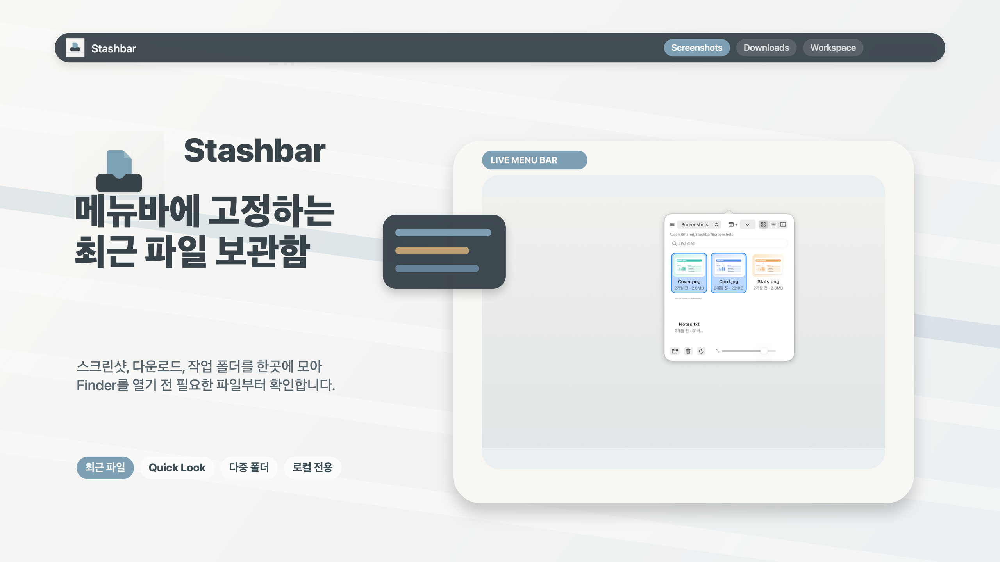
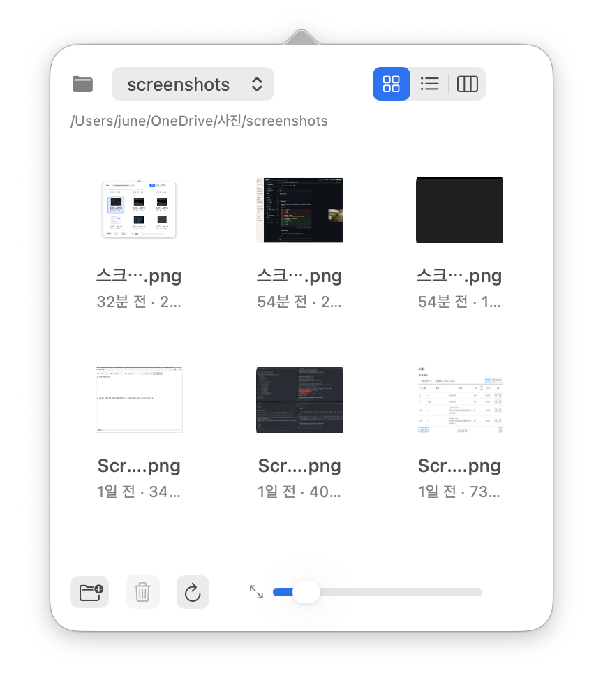

<div align="center">

# Stashbar

[](https://www.apple.com/macos/)
[](https://swift.org)
[](LICENSE)
[](https://jiun.dev/stashbar/)

**메뉴바에서 자주 보는 폴더의 최근 파일을 한눈에 — Finder처럼 자연스럽게**

[**🌐 웹사이트**](https://jiun.dev/stashbar/) · [**🔒 개인정보 처리방침**](https://jiun.dev/stashbar/privacy.html) · [**🐛 이슈 보고**](https://github.com/jiunbae/stashbar/issues)



</div>

---

## ✨ 한눈에

```
🖱  메뉴바 클릭 → 최근 파일 즉시 확인
📁  여러 폴더 동시 감시 (스크린샷, 다운로드, 작업 폴더…)
⚡  디스크 캐시로 앱 재실행해도 미리보기 즉시 표시
⌨️  Finder 단축키 그대로 (⌘C/⌘X/⌘V, ⌘⌫, Space)
```



## 주요 기능

- 📁 **다중 감시 폴더** — 폴더별로 최근 파일을 정렬해서 표시, 드롭다운으로 즉시 전환
- 🔄 **실시간 동기화** — FSEvents 기반, 파일 추가·수정·삭제 자동 반영
- 🎨 **3가지 보기 모드** — 아이콘/목록/계층, 슬라이더로 미리보기 크기 조절
- 🔠 **다중 정렬** — 이름·종류·수정 날짜·크기 × 오름/내림차순
- ⚡ **2계층 캐시** — 메모리 + 디스크 썸네일 캐시로 부드러운 스크롤과 빠른 재시작
- 👁  **Quick Look** — `Space`로 즉시 미리보기, 선택 변경 자동 갱신
- 📋 **Finder 단축키** — `⌘C/⌘X/⌘V` 복사·잘라내기·붙여넣기, `⌘⌫` 휴지통
- 🔁 **드래그 앤 드롭** — 다른 앱이나 Finder로 바로 드래그
- 🌗 **로그인 시 자동 실행** — 설정에서 토글, 모던 `SMAppService` 기반
- 🔒 **App Sandbox 호환** — security-scoped bookmark로 영속화, Mac App Store 배포 준비 완료

## 시스템 요구사항

- macOS 13.0 (Ventura) 이상
- Apple Silicon · Intel Mac 모두 지원

## 설치

### 직접 빌드해서 사용하기

```bash
git clone https://github.com/jiunbae/stashbar.git
cd stashbar

# 개발 중 실행
swift run

# 또는 .app 번들 빌드 후 실행
scripts/build_app.sh
open "dist/Stashbar.app"
```

### Mac App Store

> Mac App Store 심사 진행 중입니다. 출시되면 이 섹션에 다운로드 링크가 추가됩니다. 진행 상황은 [웹사이트](https://jiun.dev/stashbar/)에서 확인할 수 있습니다.

## MenuBucket 위젯

네이티브 앱 설치 없이 [MenuBucket](https://github.com/jiunbae/menubucket)(스크립터블 메뉴바 위젯 플랫폼)에서 Stashbar 스타일의 최근 파일 위젯을 사용할 수 있습니다. 이 저장소의 [`widgets/menubucket-recent-files/`](widgets/menubucket-recent-files/)에 위젯 정의가 포함되어 있습니다.

```bash
mbk install https://github.com/jiunbae/stashbar
```

지정한 폴더(기본: `~/Pictures/Screenshots`)의 최근 파일을 QuickLook 썸네일과 함께 메뉴바에서 바로 확인하고, 드래그로 다른 앱에 옮길 수 있습니다. 다중 폴더 감시, Finder 단축키, Quick Look 등 전체 기능은 본가 Stashbar 앱에서 제공됩니다. 자세한 내용은 [위젯 README](widgets/menubucket-recent-files/README.md)를 참조하세요.

## 사용법

| 동작 | 방법 |
|------|------|
| 폴더 추가 | popover 좌측 하단 **+** 버튼 → 폴더 선택 |
| 파일 선택 | 클릭 (다중 선택은 `⌘`/`Shift`) |
| 파일 열기 | 더블클릭 또는 우클릭 → "파일 열기" |
| Finder에서 보기 | 우클릭 → "Finder에서 보기" |
| Quick Look | 파일 선택 후 `Space` |
| 휴지통 이동 | `⌘⌫` |
| 정렬 변경 | 헤더의 정렬 메뉴 |
| 보기 모드 | 헤더 우측 segmented control |
| 미리보기 크기 | 하단 슬라이더 |
| 설정 | 메뉴바 우클릭 → "설정..." 또는 `⌘,` |

## Mac App Store 배포

이 프로젝트는 App Store 제출이 가능한 상태로 설정되어 있습니다.

### 사전 준비

1. **Apple Developer Program 가입**
2. **App ID 등록** — `developer.apple.com` → Identifiers → `com.jiunbae.FileStack`(Explicit)
3. **인증서 발급**
   - `Apple Distribution` (코드 서명용)
   - `3rd Party Mac Developer Installer` (.pkg 서명용)
4. **App Store Connect 앱 등록** — Bundle ID `com.jiunbae.FileStack` 선택

### 빌드 및 업로드

```bash
# 1. .app + .pkg 패키징 (서명까지)
SIGN_IDENTITY="Apple Distribution: Jiun Bae (TEAMID)" \
INSTALLER_IDENTITY="3rd Party Mac Developer Installer: Jiun Bae (TEAMID)" \
  scripts/package_for_app_store.sh

# 2. App Store Connect에 검증
ACTION=validate \
APPLE_API_KEY=ABCDEFG123 APPLE_API_ISSUER=<UUID> \
SIGN_IDENTITY="..." INSTALLER_IDENTITY="..." \
  scripts/package_for_app_store.sh

# 3. 업로드
ACTION=upload \
APPLE_API_KEY=ABCDEFG123 APPLE_API_ISSUER=<UUID> \
SIGN_IDENTITY="..." INSTALLER_IDENTITY="..." \
  scripts/package_for_app_store.sh
```

App Store Connect API key는 [App Store Connect → Users and Access → Integrations → App Store Connect API](https://appstoreconnect.apple.com/access/api)에서 발급받습니다. 발급된 `.p8` 파일은 `~/.appstoreconnect/private_keys/AuthKey_<KEY_ID>.p8` 경로에 저장하세요.

## 기술 스택

| 영역 | 사용 기술 |
|------|----------|
| UI | SwiftUI · AppKit (`NSCollectionView`, `NSPopover`) |
| 파일 시스템 감시 | FSEvents (`kFSEventStreamCreateFlagFileEvents`) |
| 썸네일 | `QuickLookThumbnailing` + 메모리/디스크 2계층 캐시 |
| 미리보기 | `QLPreviewPanel` |
| 로그인 아이템 | ServiceManagement (`SMAppService`) |
| 영속성 | `UserDefaults` + Security-Scoped Bookmarks |
| 빌드 | Swift Package Manager 5.9 |

### 프로젝트 구조

```
Sources/
├── FileStackCore/                  순수 모델 + 로직 (테스트 대상)
│   ├── Models.swift                FileItem, WatchedFolder, SortOption 등
│   ├── SelectionState.swift        선택 상태 ObservableObject
│   ├── FileTreeBuilder.swift       계층 보기용 재귀 트리 빌더
│   └── Localization.swift          한/영 문자열
└── FileStackApp/                   AppKit + SwiftUI UI 레이어
    ├── main.swift                  AppDelegate + 메뉴바 status item
    ├── FileStackController.swift   메인 상태, 폴더 감시 lifecycle, 클립보드
    ├── ContentView.swift           SwiftUI 루트 + 컨테이너 뷰들
    ├── IconCollectionView.swift    NSCollectionView 기반 아이콘 그리드
    ├── KeyEventHandlingView.swift  Space 키 → QuickLook 패널
    ├── DirectoryWatcher.swift      FSEvents 래퍼
    ├── ThumbnailCache.swift        메모리 캐시 + in-flight dedup
    ├── DiskThumbnailCache.swift    디스크 영속 캐시 + 자동 무효화
    ├── FileIconCache.swift         NSWorkspace 아이콘 캐시
    ├── ScreenshotSupport.swift     App Store 스크린샷 자동화 훅
    ├── SettingsView.swift          설정 화면 (로그인 시 실행, 폴더 관리)
    └── SettingsWindowController.swift  설정 윈도우

Tests/FileStackAppTests/            FileStackCore 단위 테스트
docs/                               GitHub Pages (랜딩 + 개인정보 처리방침)
AppStore/                           App Store 제출용 메타데이터/스크린샷
```

### 빌드 명령

```bash
swift build                              # 디버그 빌드
swift build -c release                   # 릴리즈 빌드
swift run                                # 직접 실행
swift test                               # FileStackCore 단위 테스트
scripts/build_app.sh                     # .app 번들 (ad-hoc 서명)
scripts/package_for_app_store.sh         # 서명 .pkg + 검증/업로드
scripts/upload_to_app_store.sh           # 키체인 해제 + 빌드 + 업로드 (편의)
```

## 개인정보 및 권한

Stashbar은 데이터를 수집하지 않으며 네트워크에 접속하지 않습니다. 사용자가 직접 선택한 폴더만 sandbox 내에서 security-scoped bookmark로 접근합니다. 자세한 내용은 [개인정보 처리방침](https://jiun.dev/stashbar/privacy.html) 또는 [PRIVACY.md](PRIVACY.md)를 참조하세요.

## 라이선스

MIT — 자세한 내용은 [LICENSE](LICENSE) 참조.

---

<div align="center">

**Made with ☕ by [@jiunbae](https://github.com/jiunbae)**

</div>
